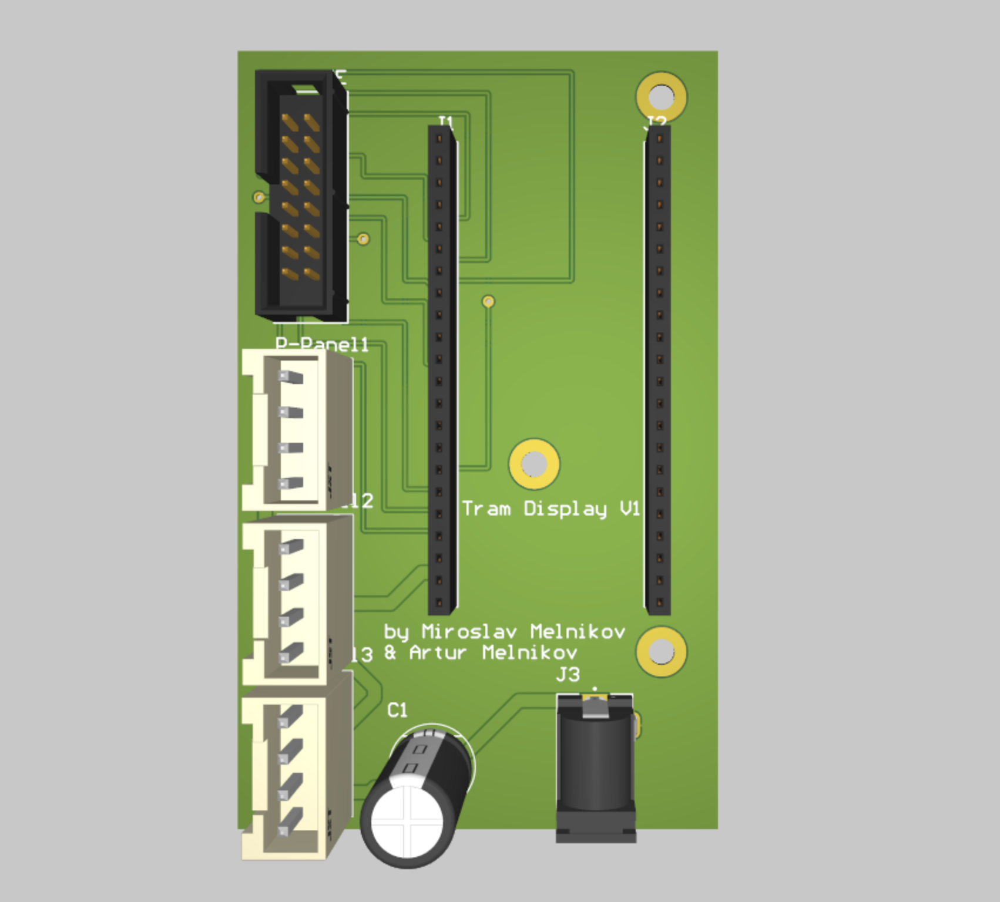
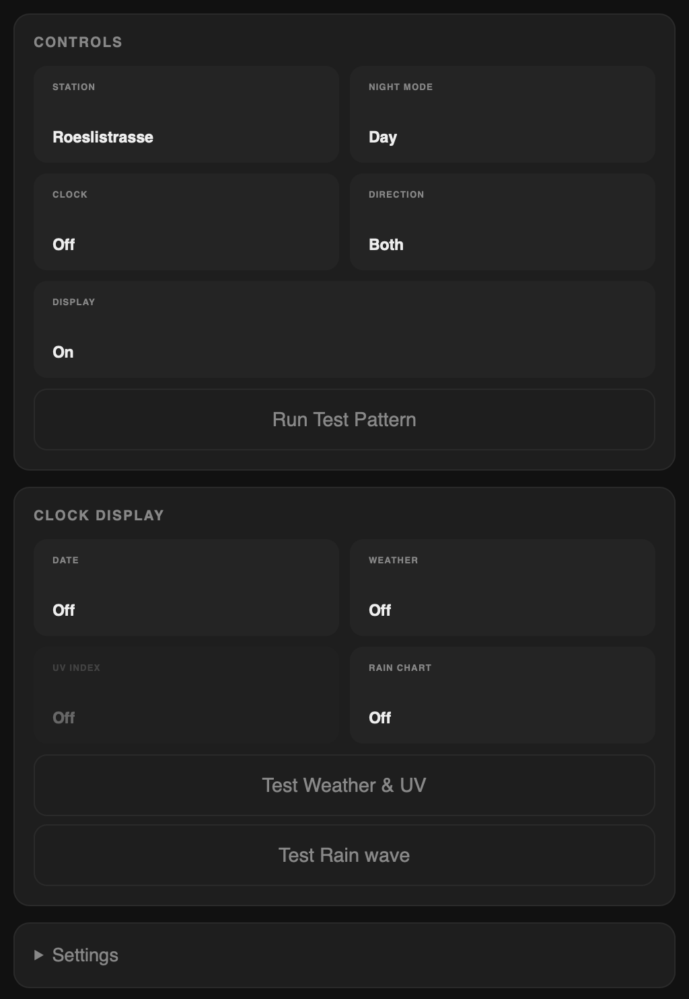

# VBZ Tram Display Clone

A homemade replica of the Zürich VBZ tram departure board — shows real-time departure data for any tram, bus, or train station in Switzerland on three chained HUB75 LED matrix panels.


> Based on the original work by [sschueller](https://github.com/sschueller/vbz-fahrgastinformation).

---

## Table of Contents

- [Background](#background)
- [Features](#features)
- [Gallery](#gallery)
- [Build Your Own](#build-your-own)
- [Hardware](#hardware)
- [Wiring](#wiring)
- [Software Setup](#software-setup)
- [OTA Updates](#ota-updates)
- [Web Interface](#web-interface)
- [Physical Button](#physical-button)
- [Night Mode](#night-mode)
- [Troubleshooting](#troubleshooting)
- [Project Structure](#project-structure)
- [Credits](#credits)

---

## Background

This project started with [sschueller's vbz-fahrgastinformation](https://github.com/sschueller/vbz-fahrgastinformation) — a faithful recreation of the actual VBZ passenger information system, complete with the real font, real line colors, and real-time data from the Swiss open transport API. His work proved the concept and laid the technical foundation: the font rendering approach, the HUB75 panel setup, and the data pipeline all trace back to his ideas.

My goal was different. I wanted something you could actually build at home without a lot of prior experience — a version that is cheaper, uses off-the-shelf parts, and comes together without fighting obscure hardware. A few things I changed or added:

- **Custom PCB** instead of a rats-nest of jumper wires — makes assembly clean and repeatable
- **Laser-cut MDF and acrylic enclosure** — gives it a finished look that doesn't feel like a prototype
- **Web UI** for configuration instead of reflashing to change stations
- **Clock screensaver** with live weather and rain forecast
- **Night mode** with automatic scheduling and manual override
- **OTA updates** so you never need to plug it in again after the first flash
- **Cheaper** — the whole build comes in around CHF 80–120 using AliExpress panels and JLCPCB, compared to buying a finished unit

The firmware was largely rewritten but the spirit of the project — and the font — come from sschueller's original work. Credit where it's due.

---

## Features

- Live departure data from [opentransportdata.swiss](https://opentransportdata.swiss), falls back to scheduled if unavailable
- Two configurable stations, switchable via button or web interface
- Direction filter: both / outbound / inbound, persisted to flash
- VBZ tram line colors for all known Zürich lines
- Accessibility indicator for low-floor vehicles
- Live vs. scheduled marker, late departure indicator
- Night mode: amber colors, low brightness, auto-scheduled (22:00–06:00) with manual override
- Clock screensaver with date and live weather via [Open-Meteo](https://open-meteo.com) — no API key needed
- Web configuration UI with live departure view and station search
- OTA firmware updates over WiFi

---

## Gallery

| | |
|---|---|
|  |  |
|  |  |

---

## Build Your Own

Total cost is roughly **CHF 80–120** depending on where you source parts.

| Component | Source | Approx. Cost |
|---|---|---|
| 3× P3 64×64 HUB75E LED panels | AliExpress | CHF 45–60 |
| Freenove ESP32-S3 WROOM | AliExpress / Amazon | CHF 12–18 |
| Custom PCB (5 pcs min) | JLCPCB / PCBWay | CHF 8–12 |
| PCB components (caps, resistors, connectors) | LCSC / Mouser | CHF 5–10 |
| 5V 3A power supply | AliExpress | CHF 5–8 |
| 3× HUB75E ribbon cables (2×8 IDC) | AliExpress | CHF 4–6 |
| Acrylic sheet 600×200mm 5mm | Local laser shop | CHF 5–10 |
| MDF sheet 600×200mm 5mm | Local laser shop | CHF 3–5 |
| M4 hardware (bolts + nuts) | Hardware store | CHF 3–5 |

> Panels are the biggest variable — prices fluctuate on AliExpress. Search **"64x64 P3 HUB75E RGB LED matrix"**.

### Steps

1. **Order parts** — use the BOM in `hardware/pcb/` for exact PCB components. Order panels, ESP32, and cables from AliExpress at the same time to save on shipping.

2. **Get the PCB made** — upload the Gerber zip from `hardware/pcb/` to [JLCPCB](https://jlcpcb.com) or [PCBWay](https://pcbway.com). Standard 2-layer, 1.6mm, any colour. Minimum order is 5 pcs for ~$2.

3. **Laser-cut the frame** — send the DXF files in `hardware/3d/` to a local laser cutting service or makerspace. 5mm MDF for the frame (paint it black), 5mm clear acrylic for the front panel.

4. **Solder the PCB** — solder all SMD components first, then connectors. The schematic and assembly drawing are in `hardware/pcb/`.

5. **Assemble** — chain the three LED panels together with ribbon cables. Connect power wires to each panel. Mount panels into the MDF frame using M4 bolts and nuts, then attach the acrylic front.

6. **Flash and configure** — follow [Software Setup](#software-setup) below. First flash is via USB; all updates after that are OTA over WiFi.

---

## Hardware

| Component | Qty | Details |
|---|---|---|
| LED Matrix Panels | 3 | 64×64px P3 HUB75E, chained (192×64px total) |
| Microcontroller | 1 | Freenove ESP32-S3 WROOM (8MB Flash / 8MB PSRAM) |
| Custom PCB | 1 | See `hardware/pcb/` — PCB components listed separately |
| Power Supply | 1 | 5V 3A DC barrel jack |
| HUB75E Ribbon Cables | 3 | 2×8 IDC, panel-to-panel and panel-to-PCB |
| JST Power Wires | 3 | Custom length, custom terminated |
| Acrylic sheet | 1 | 600×200mm, 5mm, laser-cut front panel |
| MDF sheet | 1 | 600×200mm, 5mm, laser-cut frame, painted black |
| M4 bolt 60mm | 6 | Frame assembly |
| M4 bolt 40mm | 12 | Frame assembly |
| M4 knurl nut | 9 | Frame assembly |
| M4 square nut | 12 | Frame assembly |

Laser-cut files are in `hardware/3d/`. PCB schematics and Gerber files are in `hardware/pcb/`.



---

## Wiring

The custom PCB handles the connection between the ESP32-S3 and the HUB75E panels.

| HUB75E Pin | ESP32-S3 GPIO |
|---|---|
| R1 | 4 |
| G1 | 5 |
| B1 | 6 |
| R2 | 7 |
| G2 | 15 |
| B2 | 16 |
| A | 17 |
| B | 18 |
| C | 8 |
| D | 14 |
| E | 10 |
| LAT | 11 |
| OE | 12 |
| CLK | 13 |

> Double-check against your `Config.h` — pin assignments can vary.

---

## Software Setup

### 1. Configure `firmware/include/Config.h`

Copy the template and fill in your details:

```bash
cp firmware/include/Config.h.dist firmware/include/Config.h
```

```cpp
#define OPEN_DATA_API_KEY "your_key_here"  // from opentransportdata.swiss
#define WEATHER_LAT "47.37"                // your latitude
#define WEATHER_LON "8.54"                 // your longitude
#define BRIGHTNESS_FIXED 80               // 0–255, or -1 for ambient sensor
```

Get a free API key at [opentransportdata.swiss](https://opentransportdata.swiss).
Find station BPUIC IDs in the xlsx at [bav_liste](https://opentransportdata.swiss/de/dataset/bav_liste).

### 2. Flash via USB

Open the `firmware/` folder in PlatformIO and flash:

```bash
pio run -e freenove_esp32_s3_wroom -t upload
```

### 3. Connect to WiFi

On first boot the display shows **"connect to: vbz-anzeige"**. Connect to that network (password: `123456`), open a browser — the captive portal opens automatically. Enter your home WiFi credentials and save.

### 4. Configure stations

After connecting, the display shows its IP. Open `http://<IP>/config` to set your stations, night hours, and brightness.

---

## OTA Updates

After the first USB flash, all future updates can be done wirelessly.

Set the device IP in `firmware/platformio.ini`:

```ini
upload_port = 192.168.1.xx
```

Then upload:

```bash
pio run -e ota -t upload
```

OTA password: `vbz1234` (configurable in `main.cpp`).

---

## Web Interface

Open `http://<IP>/config` in any browser on the same network.



| Button | Action |
|---|---|
| Switch Station | Toggle between Station 1 and Station 2 |
| Switch to Night / Day | Toggle night mode manually |
| Dir: Both / H / R | Cycle direction filter |
| Turn Off / On | Toggle display on/off |
| Clock: Off / On | Toggle clock screensaver |
| Test Display | Flash red/green/blue/white to verify panels |

Station search lets you look up a stop by name and fills the BPUIC ID automatically.

---

## Physical Button

| Press | Action |
|---|---|
| Single press | Switch between Station 1 and Station 2 |
| Double press | Toggle night mode |
| Long press (>800ms) | Toggle display off/on |

---

## Night Mode

Activates automatically between configured hours (default 22:00–06:00). All colors switch to amber and brightness drops to ~10%. Can be overridden manually via button or web interface — override clears at the next scheduled boundary.

---

## Troubleshooting

**Display shows garbage / random pixels**
Check ribbon cable orientation — HUB75E cables are not keyed. Try flipping the connector on the first panel.

**Only the first panel lights up**
The chain order matters. Panel 1 connects to the PCB, panel 2 connects to panel 1's output, panel 3 to panel 2's output.

**No departures shown, just dashes**
Your API key is missing or wrong. Double-check `Config.h` and make sure you have a valid key from [opentransportdata.swiss](https://opentransportdata.swiss).

**OTA upload fails**
Make sure the device is on the same network and the IP in `platformio.ini` is correct. The OTA password is `vbz1234`.

**Display flickers or shows noise**
Lower `BRIGHTNESS_FIXED` in `Config.h`. Some panels need `latch_blanking` tuned — see the comments in `Display.cpp`.

**WiFi captive portal doesn't open**
Navigate manually to `192.168.4.1` in your browser after connecting to the `vbz-anzeige` hotspot.

---

## Project Structure

```
firmware/           ESP32 PlatformIO project
hardware/
  pcb/              Schematic, Gerber files, BOM
  3d/               Laser-cut DXF files for MDF frame and acrylic panel
photos/             Build photos and renders
generate_texture.py Generates a P3 LED texture for renders
```

---

## Credits

Built on top of [sschueller's vbz-fahrgastinformation](https://github.com/sschueller/vbz-fahrgastinformation), used under MIT license. The original concept, font, and data pipeline approach all originate from his work — this project wouldn't exist without it.
