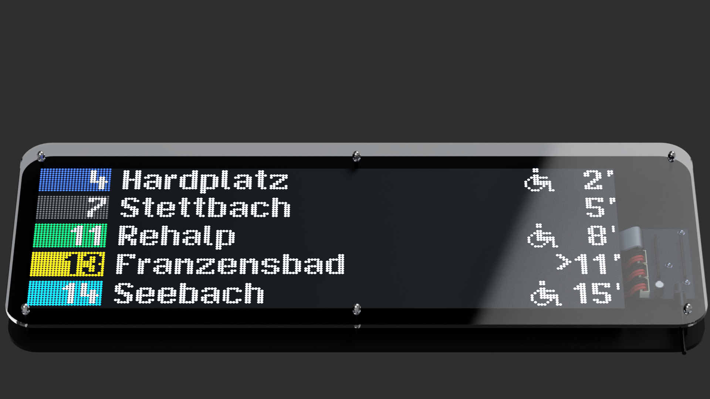
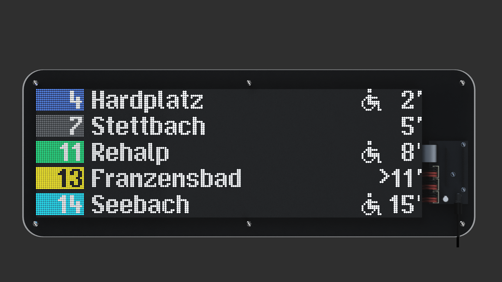
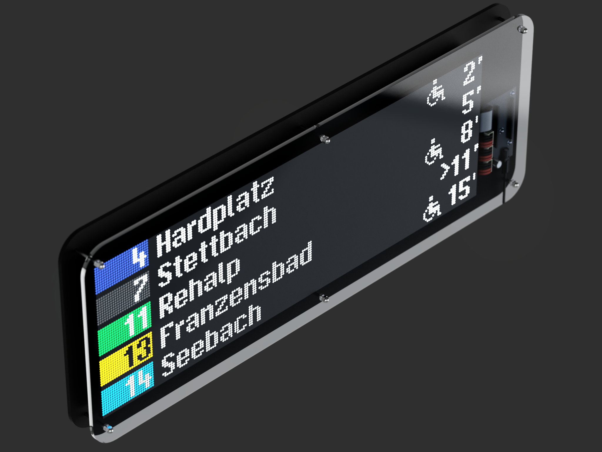
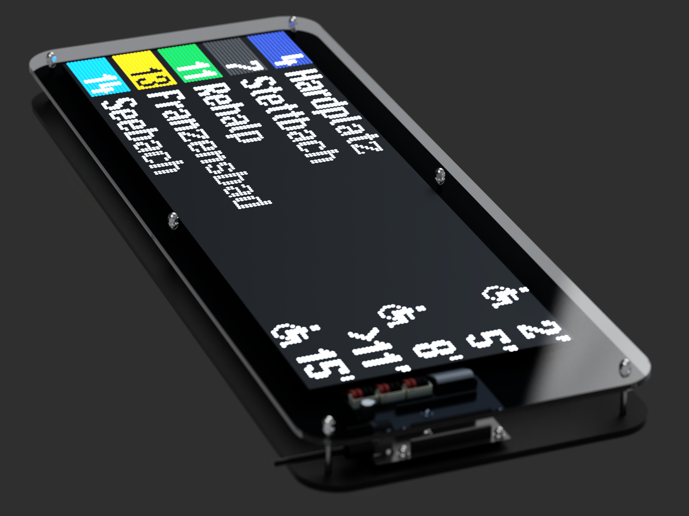

# VBZ Tram Display Clone

A homemade replica of the Zürich VBZ tram departure board — shows real-time departure data for any tram, bus, or train station in Switzerland on three chained HUB75 LED matrix panels.




> Based on the original work by [sschueller](https://github.com/sschueller/vbz-fahrgastinformation).

---

## Table of Contents

- [Features](#features)
- [Gallery](#gallery)
- [Hardware](#hardware)
- [Wiring](#wiring)
- [Software Setup](#software-setup)
- [OTA Updates](#ota-updates)
- [Web Interface](#web-interface)
- [Physical Button](#physical-button)
- [Night Mode](#night-mode)
- [Project Structure](#project-structure)
- [Credits](#credits)

---

## Features

- Live departure data from [opentransportdata.swiss](https://opentransportdata.swiss), falls back to scheduled if unavailable
- Two configurable stations, switchable via button or web interface
- Direction filter: both / outbound / inbound, persisted to flash
- VBZ tram line colors for all known Zürich lines
- Accessibility indicator for low-floor vehicles
- Live vs. scheduled marker, late departure indicator
- Night mode: amber colors, low brightness, auto-scheduled (22:00–06:00) with manual override
- Clock screensaver with date and live weather via [Open-Meteo](https://open-meteo.com) — no API key needed
- Web configuration UI with live departure view and station search
- OTA firmware updates over WiFi

---

## Gallery

| | |
|---|---|
|  |  |
|  |  |

---

## Hardware

| Component | Qty | Details |
|---|---|---|
| LED Matrix Panels | 3 | 64×64px P3 HUB75E, chained (192×64px total) |
| Microcontroller | 1 | Freenove ESP32-S3 WROOM (8MB Flash / 8MB PSRAM) |
| Custom PCB | 1 | See `hardware/pcb/` — PCB components listed separately |
| Power Supply | 1 | 5V 3A DC barrel jack |
| HUB75E Ribbon Cables | 3 | 2×8 IDC, panel-to-panel and panel-to-PCB |
| JST Power Wires | 3 | Custom length, custom terminated |
| Acrylic sheet | 1 | 600×200mm, 5mm, laser-cut front panel |
| MDF sheet | 1 | 600×200mm, 5mm, laser-cut frame, painted black |
| M4 bolt 60mm | 6 | Frame assembly |
| M4 bolt 40mm | 12 | Frame assembly |
| M4 knurl nut | 9 | Frame assembly |
| M4 square nut | 12 | Frame assembly |

Laser-cut files are in `hardware/3d/`. PCB schematics and Gerber files are in `hardware/pcb/`.

---

## Wiring

The custom PCB handles the connection between the ESP32-S3 and the HUB75E panels.

| HUB75E Pin | ESP32-S3 GPIO |
|---|---|
| R1 | 4 |
| G1 | 5 |
| B1 | 6 |
| R2 | 7 |
| G2 | 15 |
| B2 | 16 |
| A | 17 |
| B | 18 |
| C | 8 |
| D | 14 |
| E | 10 |
| LAT | 11 |
| OE | 12 |
| CLK | 13 |

> Double-check against your `Config.h` — pin assignments can vary.

---

## Software Setup

### 1. Configure `firmware/include/Config.h`

Copy the template and fill in your details:

```bash
cp firmware/include/Config.h.dist firmware/include/Config.h
```

```cpp
#define OPEN_DATA_API_KEY "your_key_here"  // from opentransportdata.swiss
#define WEATHER_LAT "47.37"                // your latitude
#define WEATHER_LON "8.54"                 // your longitude
#define BRIGHTNESS_FIXED 80               // 0–255, or -1 for ambient sensor
```

Get a free API key at [opentransportdata.swiss](https://opentransportdata.swiss).
Find station BPUIC IDs in the xlsx at [bav_liste](https://opentransportdata.swiss/de/dataset/bav_liste).

### 2. Flash via USB

Open the `firmware/` folder in PlatformIO and flash:

```bash
pio run -e freenove_esp32_s3_wroom -t upload
```

### 3. Connect to WiFi

On first boot the display shows **"connect to: vbz-anzeige"**. Connect to that network (password: `123456`), open a browser — the captive portal opens automatically. Enter your home WiFi credentials and save.

### 4. Configure stations

After connecting, the display shows its IP. Open `http://<IP>/config` to set your stations, night hours, and brightness.

---

## OTA Updates

After the first USB flash, all future updates can be done wirelessly.

Set the device IP in `firmware/platformio.ini`:

```ini
upload_port = 192.168.1.xx
```

Then upload:

```bash
pio run -e ota -t upload
```

OTA password: `vbz1234` (configurable in `main.cpp`).

---

## Web Interface

Open `http://<IP>/config` in any browser on the same network.

| Button | Action |
|---|---|
| Switch Station | Toggle between Station 1 and Station 2 |
| Switch to Night / Day | Toggle night mode manually |
| Dir: Both / H / R | Cycle direction filter |
| Turn Off / On | Toggle display on/off |
| Clock: Off / On | Toggle clock screensaver |
| Test Display | Flash red/green/blue/white to verify panels |

Station search lets you look up a stop by name and fills the BPUIC ID automatically.

---

## Physical Button

| Press | Action |
|---|---|
| Single press | Switch between Station 1 and Station 2 |
| Double press | Toggle night mode |
| Long press (>800ms) | Toggle display off/on |

---

## Night Mode

Activates automatically between configured hours (default 22:00–06:00). All colors switch to amber and brightness drops to ~10%. Can be overridden manually via button or web interface — override clears at the next scheduled boundary.

---

## Project Structure

```
firmware/           ESP32 PlatformIO project
hardware/
  pcb/              Schematic, Gerber files, BOM
  3d/               Laser-cut DXF files for MDF frame and acrylic panel
photos/             Build photos and renders
generate_texture.py Generates a P3 LED texture for renders
```

---

## Credits

Based on the original project by [sschueller](https://github.com/sschueller/vbz-fahrgastinformation), used under MIT license.
